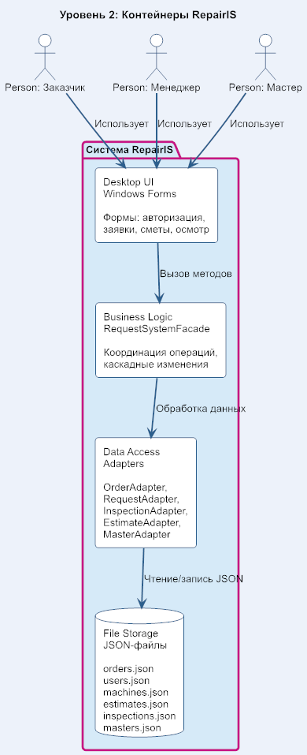

# C4 Level 2 — Контейнеры системы RepairIS

## Компоненты системы

### 1. Desktop UI (Windows Forms)
Формы приложения для взаимодействия с пользователем:
- Форма авторизации
- Главное меню (для каждой роли)
- Форма создания заявки
- Форма просмотра заявок
- Форма обработки заявки
- Форма назначения мастера
- Форма осмотра станка
- Форма статуса ремонта
- Форма формирования сметы
- Форма добавления мастера
- Карточка станка

**Технология:** C# Windows Forms, .NET Framework.

### 2. Business Logic (RequestSystemFacade)
Фасад — единая точка входа для всех операций.
Методы:
- `createOrder()` — создание заявки
- `changeStatus()` — изменение статуса
- `assignMaster()` — назначение мастера
- `saveEstimate()` — сохранение сметы
- `confirmEstimate()` — подтверждение сметы

**Технология:** C# классы.

### 3. Data Access (Adapters)
Адаптеры для работы с JSON:
- **OrderAdapter** — заявки
- **RequestAdapter** — запросы
- **InspectionAdapter** — осмотры
- **EstimateAdapter** — сметы
- **MasterAdapter** — мастера

**Технология:** C# классы, Newtonsoft.Json.

### 4. File Storage (JSON)
Файлы данных:
- `orders.json` — заявки
- `users.json` — пользователи
- `machines.json` — станки
- `inspections.json` — осмотры
- `estimates.json` — сметы
- `masters.json` — мастера
- `status_history.json` — история статусов

**Технология:** файловая система, JSON.

## Потоки данных

1. Акторы → UI (действия пользователя)
2. UI → Business Logic (вызов методов)
3. Business Logic → Adapters (обработка данных)
4. Adapters → JSON (чтение/запись)

## Обоснование архитектуры

- **Desktop UI** — система для внутреннего использования на рабочих станциях предприятия.
- **Facade** — единая точка входа, упрощает работу UI с бизнес-логикой.
- **Adapter** — каждый адаптер работает с одним JSON-файлом, обеспечивает слабую связанность слоёв.
- **JSON** — не требует установки СУБД, достаточен для малого объёма данных.
