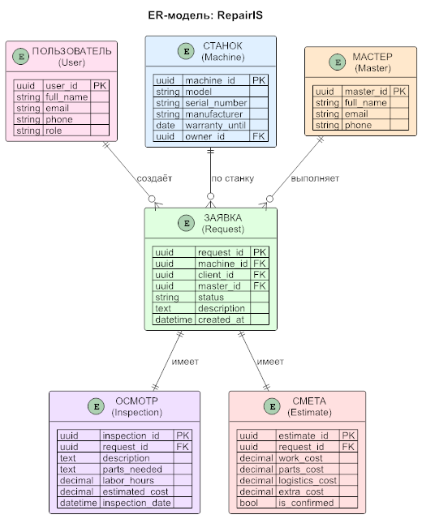

# ER-диаграмма и модель данных RepairIS

## Сущности и атрибуты

### User (Пользователь)
| Поле | Тип | Ключ | Описание |
|---|---|---|---|
| user_id | uuid | PK | Первичный ключ |
| full_name | string | | ФИО |
| email | string | | Email |
| phone | string | | Телефон |
| role | string | | Заказчик / Менеджер / Мастер |

### Machine (Станок)
| Поле | Тип | Ключ | Описание |
|---|---|---|---|
| machine_id | uuid | PK | Первичный ключ |
| model | string | | Модель |
| serial_number | string | | Серийный номер |
| manufacturer | string | | Производитель |
| warranty_until | date | | Гарантия до |
| owner_id | uuid | FK | Ссылка на User |

### Master (Мастер)
| Поле | Тип | Ключ | Описание |
|---|---|---|---|
| master_id | uuid | PK | Первичный ключ |
| full_name | string | | ФИО |
| email | string | | Email |
| phone | string | | Телефон |

### Request (Заявка)
| Поле | Тип | Ключ | Описание |
|---|---|---|---|
| request_id | uuid | PK | Первичный ключ |
| machine_id | uuid | FK | Ссылка на Machine |
| client_id | uuid | FK | Ссылка на User (заказчик) |
| master_id | uuid | FK | Ссылка на Master |
| status | string | | Статус заявки |
| description | text | | Описание проблемы |
| created_at | datetime | | Дата создания |

### Inspection (Осмотр)
| Поле | Тип | Ключ | Описание |
|---|---|---|---|
| inspection_id | uuid | PK | Первичный ключ |
| request_id | uuid | FK | Ссылка на Request |
| description | text | | Описание неисправностей |
| parts_needed | text | | Необходимые детали |
| labor_hours | decimal | | Трудоёмкость |
| estimated_cost | decimal | | Ориентировочная стоимость |
| inspection_date | datetime | | Дата осмотра |

### Estimate (Смета)
| Поле | Тип | Ключ | Описание |
|---|---|---|---|
| estimate_id | uuid | PK | Первичный ключ |
| request_id | uuid | FK | Ссылка на Request |
| work_cost | decimal | | Стоимость работ |
| parts_cost | decimal | | Стоимость деталей |
| logistics_cost | decimal | | Логистика |
| extra_cost | decimal | | Дополнительные расходы |
| is_confirmed | bool | | Подтверждена? |

## Связи

| Связь | Тип | Описание |
|---|---|---|
| User → Request | 1:N | Один заказчик — много заявок |
| Machine → Request | 1:N | Один станок — много заявок |
| Master → Request | 1:N | Один мастер — много заявок |
| Request → Inspection | 1:1 | Одна заявка — один осмотр |
| Request → Estimate | 1:1 | Одна заявка — одна смета |

## Нормализация

### Первая нормальная форма (1НФ)
✅ Все атрибуты атомарны (нет составных полей).
✅ Нет повторяющихся групп атрибутов.
✅ У каждой сущности есть первичный ключ (PK).

### Вторая нормальная форма (2НФ)
✅ Все неключевые атрибуты зависят от полного первичного ключа.
✅ Первичные ключи простые (одно поле — `*_id`), поэтому частичных зависимостей нет.

### Третья нормальная форма (3НФ)
✅ Нет транзитивных зависимостей.
- В таблице **Request** хранится `client_id` (ссылка на User), а не ФИО клиента.
- В таблице **Request** хранится `machine_id` (ссылка на Machine), а не модель станка.
- В таблице **Request** хранится `master_id` (ссылка на Master), а не ФИО мастера.
- В таблице **Inspection** хранится `request_id` (ссылка), а не данные заявки.
- В таблице **Estimate** хранится `request_id` (ссылка), а не данные заявки.

**Модель данных соответствует третьей нормальной форме (3НФ).** ✅
